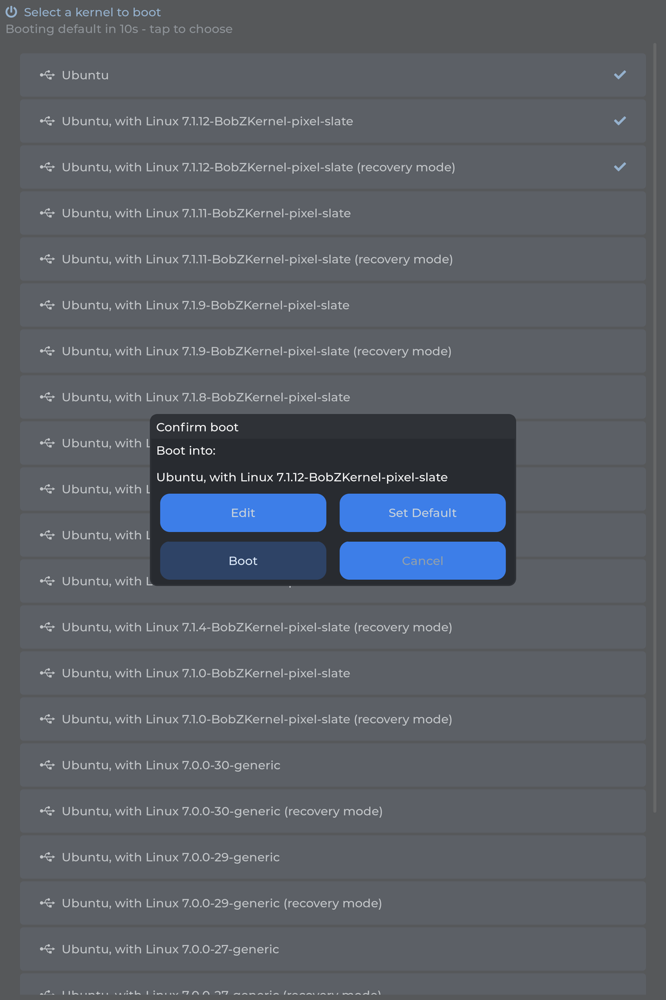
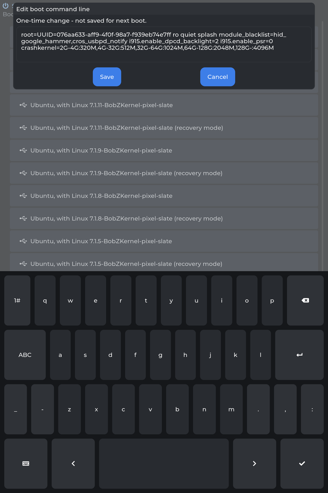
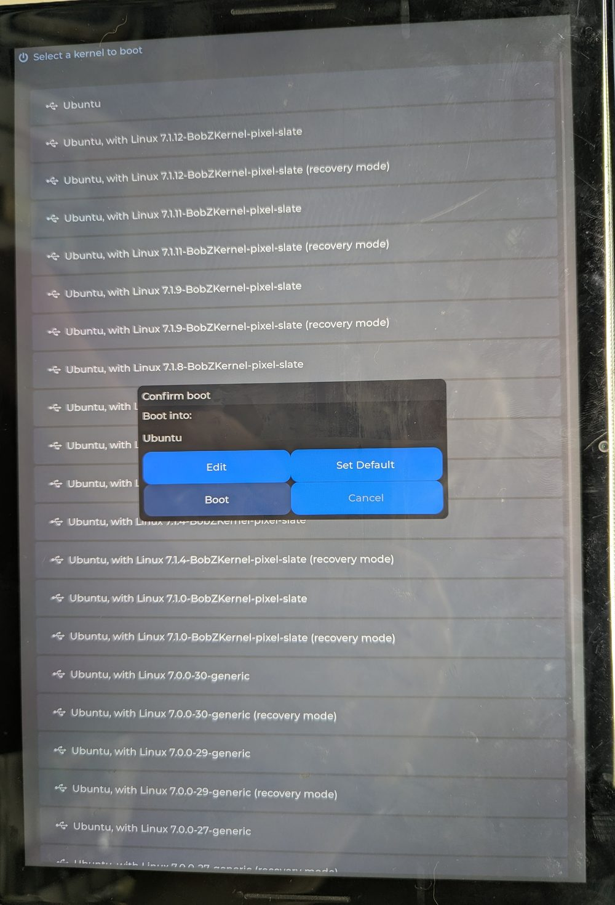
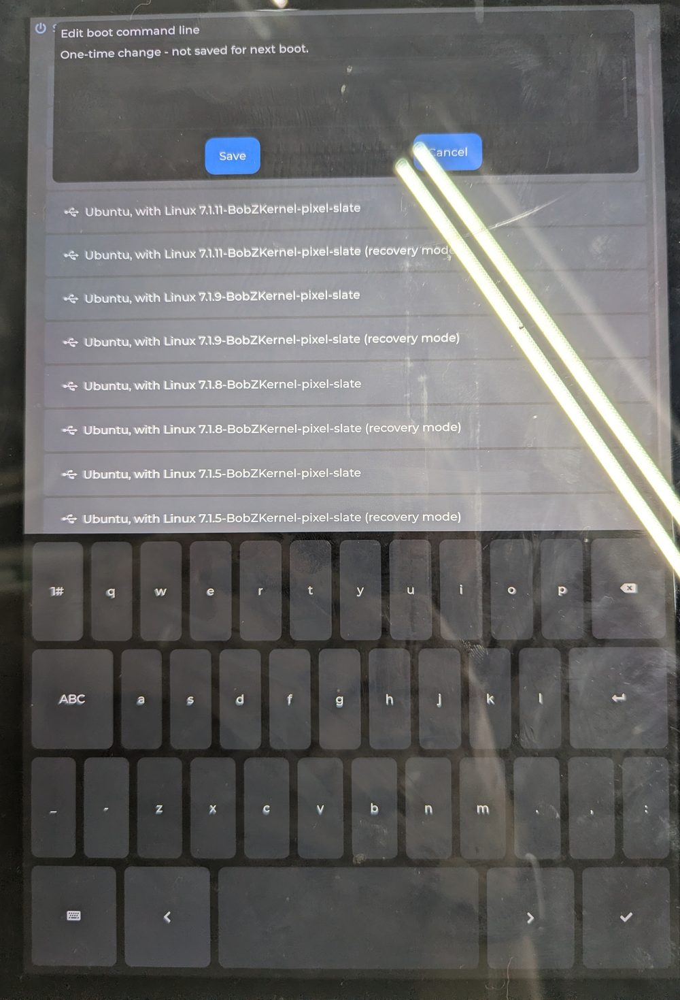

# nocturne-boot-picker

A touch-driven boot picker for the Google Pixel Slate (`nocturne`), TWRP-style —
replacing GRUB's mouse/keyboard-only menu with something you can actually use
on a tablet with no keyboard attached.

**Status: working end-to-end on real hardware.** Tap a kernel, confirm, and it
`kexec`s straight into it. Confirmed on the Slate: touch selection, screen
rotation, editing a kernel command line with an on-screen keyboard, and
persisting a default. It is currently the machine's default GRUB entry.

This is a deliberately separate project from
[BobZKernel](https://github.com/thewraith420/BobZKernel), which builds the
*real* installed kernels this picker boots into — and, on its `picker-kernel`
branch, the minimal kernel this picker itself runs on.

## The problem

The Slate is tablet-first — no permanently attached keyboard or mouse. GRUB's
menu needs both to navigate. Picking a non-default kernel meant finding a
keyboard, or not doing it at all.

## The design

**UEFI/GRUB has essentially no touchscreen driver support.** That is a dead
end — don't try to add touch input to GRUB itself.

**The unlock: TWRP was never a bootloader.** It is a minimal Linux kernel +
initramfs with real touch drivers, that the *real* bootloader hands control to
instead of booting normally. The same trick applies here:

1. GRUB stays **completely unmodified** — no `update-grub`, no regenerated
   `grub.cfg`, no reordered entries.
2. A GRUB entry boots a small dedicated **picker kernel + initramfs** — not a
   real OS, just enough Linux to draw a touch menu.
3. The picker has **real mainline touch + DRM drivers**, parses the live
   `grub.cfg` for available kernels, and waits for a tap.
4. On selection it `kexec`s straight into the real kernel that was tapped.

So the scope is a minimal kernel config + a small initramfs + a touch UI +
kexec glue. Not a bootloader rewrite.

## What a boot looks like

```
GRUB  →  picker kernel  →  init (PID 1)  →  mount real root (ro)
      →  discover-kernels.sh reads the live /boot/grub/grub.cfg
      →  picker draws the touch menu   →  tap → confirm
      →  kexec into the chosen kernel
```

Tapping a row opens a confirm dialog with four actions: **Boot**, **Cancel**,
**Edit** (change this boot's kernel command line via an on-screen keyboard,
one-time, not persisted) and **Set Default** (persist this kernel as the
first entry for future boots).

If nothing is tapped within `PICKER_TIMEOUT_SECS` (default 10) it boots the
first entry, exactly like GRUB's own timeout. That matters on a keyboardless
device: it is the reason a broken touchscreen cannot strand you.

### Screenshots

  

*The kernel list (checkmarks mark the saved default), the confirm dialog, and
Edit's on-screen keyboard with the full command line wrapped for reading.*

These are real renders of the current code, not mockups: `ui/render-screens.c`
includes `picker.c` and calls the same `build_ui()` / `open_confirm_dialog()`
/ Edit handler the device runs, through picker's own flush and screenshot
paths, with a memory buffer standing in for the DRM scanout mapping. So they
show exactly what the panel shows, at full 2000x3000, and they stay current
by being regenerated rather than re-photographed:

```sh
cd ui && make render-screens
./render-screens /path/to/menu.tsv /tmp/shots && ./ppm-to-png.sh /tmp/shots/*.ppm
```

And the same thing on the actual hardware, unretouched:

 

*Phone photos from the night the whole boot chain first worked end to end.
The confirm dialog here predates the button-spacing fix, so its buttons sit
edge-to-edge — compare the render above.*

`picker` can also capture itself on the device
(`PICKER_SCREENSHOT_DIR=/path ./picker menu.tsv`), correctly un-rotated
regardless of panel orientation — see [`ui/README.md`](ui/README.md#screenshots).

## Building and installing

Everything except the kernel builds **on the Slate itself** — the initramfs
bundles the local libc, so a mismatch produces a picker that won't start.

```sh
# 1. the picker kernel (in the BobZKernel repo, picker-kernel branch)
cd BobZKernel && ./scripts/build-kernel-7.1.sh    # auto-selects config-7.1-picker

# 2. the touch UI
cd nocturne-boot-picker/ui && ./fetch-lvgl.sh && make

# 3. the initramfs (verifies itself at the end)
cd ../initramfs && ./build-initramfs.sh

# 4. install + add the GRUB entry
cd ../boot-integration
sudo ./install-picker.sh /path/to/vmlinuz-picker ../initramfs/picker-initramfs.img
```

`install-picker.sh --uninstall` reverses it completely.

### Why installation is deliberately paranoid

The failure mode is "this machine now boots into a stripped-down kernel by
default", so three properties are structural rather than a matter of
remembering to be careful:

- Files go in **`/boot/picker/`**, a subdirectory. GRUB's `10_linux` globs
  `/boot/vmlinuz-*` and does not recurse, so this kernel can never be
  auto-detected into a menu entry on its own — not now, and not during some
  future `apt` upgrade that regenerates `grub.cfg` unattended.
- The entry goes in **`/boot/grub/custom.cfg`**, which `41_custom` sources at
  boot. So this **never runs `update-grub`**: the existing menu is not
  regenerated, not reordered, and no other entry changes position.
- It **refuses to run under `GRUB_DEFAULT=saved`**, where booting the picker
  once would silently make it the permanent default.

The kernel command line for the entry is derived from `/proc/cmdline` rather
than hardcoded — the running system is by definition a working display
configuration on this hardware, so whatever lights the panel now is carried
across. Override with `PICKER_CMDLINE=...`.

## Diagnostics

The picker runs in a window with no journal, no scrollback, and no network. So
every boot writes **`/boot/picker-last-boot.log`** to the real root: outcome,
stage trail, whether the selection came from a tap or the timeout, `picker`'s
exit code and full stderr, `/dev/dri` and `/dev/input` listings,
`/proc/bus/input/devices`, `/sys/bus/i2c/devices`, and the full `dmesg`.

On the fallback path it also prints a banner on screen and holds for
`PICKER_FALLBACK_PAUSE` seconds (default 8) so it can be read or photographed
before the kexec wipes the display.

This exists because a silent fallback is externally indistinguishable from
"the GRUB selection never took", and one whole boot attempt was lost to
exactly that ambiguity.

### Knobs

| Variable | Default | What it does |
| --- | --- | --- |
| `PICKER_ROTATE` | `270` (set by `init`) | Panel rotation: 0/90/180/270 |
| `PICKER_TIMEOUT_SECS` | `10` | Auto-boot the first entry; `0` disables |
| `PICKER_WAIT_SECS` | `20` | How long `picker` waits for DRM and touch |
| `PICKER_WAIT_ROOT` | `15` | How long `init` waits for the root device |
| `PICKER_FALLBACK_PAUSE` | `8` | On-screen hold before a fallback kexec |
| `REAL_ROOT_DEV` | `/dev/mmcblk0p2` | Partition holding `/boot/grub/grub.cfg` |

## Testing

Both suites are confirmed to *catch* the bugs they cover — each was validated
by deliberately reintroducing the original defect and checking the suite goes
red, not merely by watching it pass.

```sh
bash initramfs/test-init.sh   # runs the REAL init against mocks: the fallback
                              # chain, rescue paths, diagnostics, device waits.
                              # Runs twice - dash+coreutils, then busybox with
                              # the host PATH removed, since busybox is what
                              # the initramfs actually uses.

cd ui && make test            # headless LVGL: keyboard z-order, dialog and
                              # keyboard layout, the 2x2 confirm grid shape.
```

`build-initramfs.sh` also runs `verify-initramfs.sh` automatically, which
checks the things that otherwise surface only as a bare kernel panic: `/init`
executable with a shebang resolving *inside the image*, every absolute path
`init` references present (read out of `init` itself, so it cannot drift),
every ELF's `DT_NEEDED` libraries **and dynamic loader** resolving inside the
image, no dangling applet symlinks, and `/dev/console` + `/dev/null` as real
character devices.

## Hardware facts (confirmed on the machine, not guessed)

- **Touch is fully generic/mainline**: `intel_lpss_pci` → `i2c_designware` →
  `i2c_hid_acpi` → `hid_multitouch`, device `WCOM50C1` / `2D1F:486C`. No
  vendor blob.
- **Graphics is `i915`** (Intel UHD 615). The panel needs
  `i915.enable_dpcd_backlight=2 i915.enable_psr=0` or it produces no visible
  output.
- **Display is 3000x2000 at ~293 PPI**, mounted rotated — `PICKER_ROTATE=270`
  is upright. Touch targets are sized in real-world units off that DPI
  (~1cm buttons), because the theme's own defaults come out around 1mm.
- Root and `/boot` are the same ext4 partition, `/dev/mmcblk0p2` (eMMC).

## Findings worth knowing before changing this code

Each of these cost a boot cycle or more to find.

- **A driver being built in does not mean the bus it attaches to exists.**
  Touch never enumerated for three attempts with `I2C_HID`, `I2C_HID_ACPI`
  and `HID_MULTITOUCH` all correctly `=y`. On Intel LPSS the I2C controller
  is a *PCI* device whose MFD driver manufactures the *platform* device those
  drivers bind to — and `MFD_INTEL_LPSS_PCI` was `=m`, so in an initramfs with
  no modprobe the bus simply never appeared. Found by walking `/sys/devices`
  on a machine where touch worked, not by re-reading configs.
- **A success return is not proof of a visible result.** With the i915 quirks
  missing, `drmModeSetCrtc` returned *success* into an unlit panel. The whole
  chain ran perfectly — touch found, menu drawn, kexec completed — against a
  black screen. No error handling inside `picker` could have caught it.
- **`init` races driver probe; a hand-run test never does.** As PID 1 it
  reaches `picker` ~0.85s after the kernel starts, while devices are still
  enumerating. `picker` waits for its own devices by retrying the real
  `drm_open_first_connected()` / `touch_open()`, rather than `init` guessing
  from shell — an earlier "does any `/dev/input/event*` exist" check was
  satisfied instantly by unrelated devices and waited zero seconds.
  **The component that owns the criteria should own the waiting.**
- **LVGL's default allocator is a 64 kB fixed pool.** Dialogs hung or
  segfaulted inconsistently until `LV_USE_STDLIB_MALLOC` was switched to
  `LV_STDLIB_CLIB`. Inconsistent results across near-identical variants is the
  signature of a resource limit, not a logic bug. Do not "optimize" that back.
- **Dialogs and the on-screen keyboard live on `lv_layer_top()`**, because
  `lv_msgbox_create(NULL)` puts its backdrop there. Anything parented to
  `lv_screen_active()` renders *under* that backdrop and receives no touches.
- **This display is driven manually, so nothing decides a repaint is due.**
  Content can be set, laid out and positioned correctly and still not appear
  until something calls `lv_obj_invalidate()`.
- **LVGL is never told about rotation.** `PICKER_ROTATE` is handled by this
  code's own transform at exactly two points (flush callback and touch input);
  LVGL's own rotation support hands `flush_cb` a buffer still in unrotated
  space and hangs outright with `LV_DISPLAY_RENDER_MODE_FULL`.

## Directory layout

```
nocturne-boot-picker/
├── README.md              # this file
├── picker-kernel/         # how the BobZKernel picker-kernel branch plugs in
├── initramfs/             # init (PID 1), kernel discovery, build + verify + tests
├── ui/                    # picker.c (LVGL touch menu), lv_conf.h, layout tests
├── boot-integration/      # install-picker.sh, kexec glue, GRUB entry template
└── docs/                  # hardware findings, the real grub.cfg used as a fixture
```

Each directory has its own README with the reasoning behind what is in it.

## Design decisions

1. **Kernel config**: BobZKernel's `pixel-slate` branch as the base, on a
   dedicated `picker-kernel` branch. Inherits the load-bearing platform fixes
   for free — i915 backlight quirks, the `hid_google_hammer` crash fix, the
   GOOG0007 button fix — without polluting the real installed-kernel branch,
   then stripped down. **Everything the picker touches must be `=y`**: the
   initramfs has no modprobe and no `/lib/modules`.
2. **Touch UI**: LVGL v9.2.2, fetched at build time (`ui/fetch-lvgl.sh`), not
   vendored. Chosen over raw DRM drawing after seeing a plain-text version on
   hardware — a real themed widget/dialog UI, far faster than hand-rolling one.
3. **Boot entry discovery**: parse the real GRUB config live, not a
   picker-owned copy. A stale copy is actively dangerous — it offers a kernel
   that is gone, or silently omits a new one. `discover-kernels.sh` walks
   `menuentry` stanzas at any nesting depth (real kernels sit inside "Advanced
   options"), keeps only entries whose `linux` line points at a `vmlinuz`, and
   excludes the picker's own entry. Verified against the Slate's real 25-entry
   `grub.cfg`, kept as `docs/nocturne-grub.cfg`.

## Recovery

The picker is now the default GRUB entry, with GRUB's own timeout left in
place. If anything in the chain misbehaves, `init` falls back to booting the
first discovered kernel rather than stranding you, and `picker`'s own timeout
does the same if the display or touch fails. A long power-button press is the
hard reset. `install-picker.sh --uninstall` removes the picker entirely and
touches nothing else.

Note that with no keyboard attached, GRUB's menu cannot be navigated off the
default — so a broken picker image would loop until a keyboard is available.
Worth having one to hand when rebuilding the initramfs.
